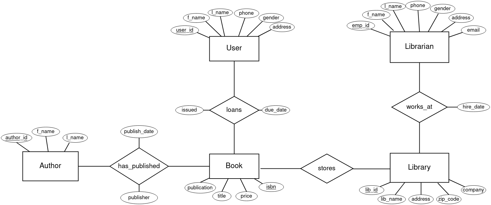

# a3
## library management
---
A library must keep track of books and their current status (if a person has been lent a book or if it is stored in the library). \\
**Entities**: \\
- User (<u>user_id</u>, f_name, l_name, gender, email, phone, address)
- Librarian (<u>emp_id</u>, f_name, l_name, gender, phone, address)
- Library (<u>lib_id</u>, lib_name, address, city, zipcode, country, company)
- Book (<u>isbn</u>, title, genre, price, publication)
- Author (<u>author_id</u>, f_name, l_name) \\
**Relation entities**
- has_published(<u>author_id</u>, <u>isbn</u>)
- loans(<u>user_id</u>, <u>isbn</u>, issued, due_date, fine)
- works_at(<u>emp_id</u>, <u>lib_number</u>, hire_date)
---

