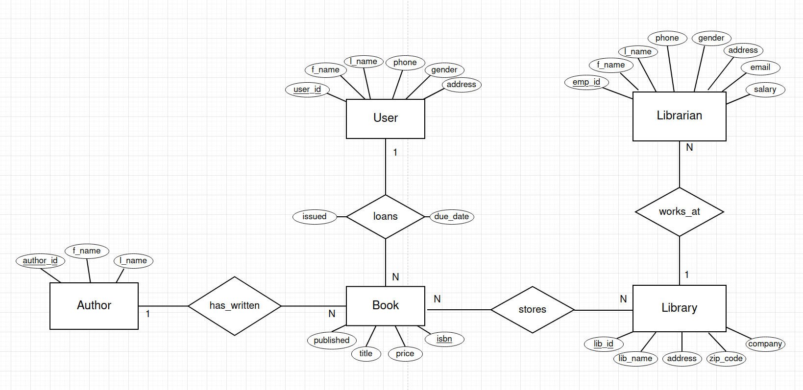

## library management system
---
A library must keep track of books and their current status (if a person has been lent a book or if it is stored in the library).  
### **Entities**:  
- User (<u>user_id</u>, f_name, l_name, gender, email, phone, address)
- Librarian (<u>emp_id</u>, f_name, l_name, gender, phone, address)
- Library (<u>lib_id</u>, lib_name, address, city, zipcode, country, company)
- Book (<u>isbn</u>, title, genre, price)
- Author (<u>author_id</u>, f_name, l_name)  
- has_published(<u>author_id</u>, <u>isbn</u>)
- loans(<u>user_id</u>, <u>isbn</u>, issued, due_date, fine)
- works_at(<u>emp_id</u>, <u>lib_number</u>, hire_date)
- stored_at(isbn, lib\_id)
---
Having an ID on *Library* only makes sense if the library in turn is owned by a company that has multiple libraries. I might change the key for *Library* for that reason.  

A book can have more than one genre, therefore genre in *Book* is a potential multivalued attribute. Having book details in a separate table could be a solution. For this assignment I'm just going to acknowledge it but keep things as they are.  

Obviously books of the same title are going to reside in many different libraries. A new relation *stored* with the key (isbn, lib\_id) would work as a reference to reduce redundant data instead of having it in *Book* directly. I did begin to implement this but the time is running out and it just feels kind of overkill. *Book* has an attribute *lib_id* which points directly to *Library* rather than another entity that also holds data concerning the amount of books of the same sort that are available.

The requirement to use a **view** is somewhat forced in my solution. The way I implemented it was as if the system was planned to be divided in to two different parts. One part that held high privileges acting as admin and the other part for commercial use (for individual users). To gather employee information without revealing the more personal information a *view* is created that excludes everything except the name and gender. This approach could be replaced by a simple select query instead but I find few to none other cases where I can utilize a *view*. Since there is an option to see average salary for the employees in the menu, this may seem odd but it is because of the missing line between the admin part and the commercial part. 
  
The other requirement concerning **JOIN** can also be seen as somewhat dull and redundant in my code as well.
My tables don't hold that much of different data and those that do don't really make sense to join. If my *Author* had more attributes such as date of birth, country they reside in, address etc. then a join would make more sense if a query was to be made regarding something like countries. Here the data would be linked somehow and something like genres coupled with author's countries could get fetched as a query and interesting links between the data could be shown. I lack that as of now, so the join operation may seem useless here as well.

---

